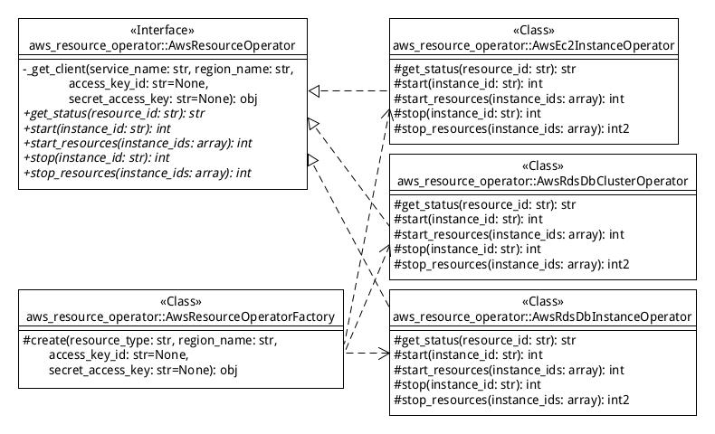

# AWS Utilities

## aws_resource_start_stop モジュール

start_stop_aws_resources 関数を実行すると、EC2インスタンスの開始、または停止を
行うことができます。開始／停止の対象となるEC2インスタンスを参照するための
定義ファイルのキー、及び開始／終了の区別は、関数の引数の event、または context
から取得します。

* event 引数
    CloudWatch のイベントルールて指定したイベントを指定します。
* context 引数
    Lambda 関数 のコンテキストを指定します。start_stop_aws_resources関すは、
    ここから Lambda関数の関数名を取得します。

### 利用方法

1. Lambda 関数の作成

    * IAMロールの設定

        EC2インスタンスの開始／停止権限を設定するために IAM ポリシーを作成する。

            {
              "Version": "2012-10-17",
              "Statement": [
                {
                  "Effect": "Allow",
                  "Action": [
                    "logs:CreateLogGroup",
                    "logs:CreateLogStream",
                    "logs:PutLogEvents"
                  ],
                  "Resource": "arn:aws:logs:*:*:*"
                },
                {
                  "Effect": "Allow",
                  "Action": [
                    "ec2:Start*",
                    "ec2:Stop*"
                  ],
                  "Resource": "*"
                },
                {
                  "Sid": "VisualEditor0",
                  "Effect": "Allow",
                  "Action": [
                    "rds:StartDBCluster",
                    "rds:StopDBCluster",
                    "rds:ListTagsForResource",
                    "rds:DescribeDBInstances",
                    "rds:StopDBInstance",
                    "rds:DescribeDBClusters",
                    "rds:StartDBInstance"
                  ],
                  "Resource": "*"
                }
              ]
            }

    * Lambda 関数の作成

        Lambda 関数を作成して、Lambda 関数に適用したロールに対して上記で作成した
        IAM ロールをアタッチする。開始／終了対象のEC2インスタンスを参照するための
        設定ファイルのっキー、及び開始／終了の種別を Lambda 関数名から取得したい
        場合は、「CloudWatch Event からの Lambda 関数の呼び出し」で説明した
        関数名のルールに従うこと。

2. aws_resource_start_stop モジュールの配備

    作成した Lambda 関数のプロジェクト ディレクトリーにawsutils モジュール
    （awsutils ディレクトリ）とその依存パッケージを配置する。

    依存パッケージは、プロジェクト ディレクトリー配下に 「requirements.txt」を
    配置して、プロジェクト ディレクトリーで以下のコマンドを実行して取得する。

        python -m pip install -t . -r requirements.txt

    プロジェクト ディレクトリー配下のファイル、ディレクトリーを zip に圧縮して
    Lambda 関数に配備する。

3. Lambda 関数からの start_stop_aws_resources 関数の呼び出し

    Lambda 関数のプロジェクト ディレクトリー配下の「lambda_function.py」
    ファイルに以下のコードを実装する（evemt 引数から EC2 の起動／停止の情報を
    取得する場合）。

        from awsutils import aws_resource_start_stop
        import logging
        import sys
        import traceback
        
        root = logging.getLogger()
        if root.handlers:
            for handler in root.handlers:
                root.removeHandler(handler)
        logging.basicConfig(stream=sys.stdout, level=logging.INFO)
        
        def lambda_handler(event, context):
            try:
                aws_resource_start_stop.start_stop_aws_resources(event, context)
                return 0
            except Exception  as e:
                logging.error(str(e.__class__) + ': ' +  str(e))
                traceback.print_stack(file=sys.stdout)
                raise

    Lambda 関数名から EC2 の起動／停止の情報を取得する場合は、
    start_stop_aws_resources 関数を以下のように呼び出す。

        aws_resource_start_stop.start_stop_aws_resources(event, context, False)

4. 設定ファイルの編集

    Lambda 関数のルートディレクトリーに配置した aws_resource_start_stop.yml
    ファイルを以下のように編集する。

        region_name: ≪region-name≫
        ≪keyname01≫:
          - type: ec2.instance
            ids:
              - ≪ec2instance-id≫
              - ≪ec2instance-id≫
                ...
          - type: rds.db_cluster
            ids:
              - ≪dbcluster-id≫
              - ≪dbcluster-id≫
                ...
          - type: rds.db_instance
            ids:
              - ≪dbinstance-id≫
              - ≪dbinstance-id≫
                ...
        ≪keyname02≫:
          - type: ec2.instance
            ids:
              - ≪instance-id≫
            ...

5. CloudWatch Event からの Lambda 関数の呼び出し

    CloudWatch でイベントのルールを作成し、ターゲットに先に作成した Lambda
    関数を指定する。

    * EC2の起動／停止の情報を event から取得する場合

        ターゲットの入力の設定で「定数(JSONテキスト)」を選択し、以下のように
        記述する。

            {"action": "start", "configKey": "≪keyname01≫"}

        または

            {"action": "start", "configKey": ["≪keyname01≫", "≪keyname02≫", ...]}

        action には、"start" または "stop"、configKeyには設定ファイルに
        定義したキーの名前または名前の配列を指定する。

    * EC2の起動／停止の情報を Lambda 関数名から取得する場合

        以下のルールに従ってLambda 関数名を決めます。

        * ec2_start_≪設定ファイルのキー≫ （EC2インスタンスを開始する場合）
        * ec2_stop_≪設定ファイルのキー≫ (EC2インスタンスを停止する場合)

6. 設計情報

  

## aws_s3_upload モジュール

upload_file 関数を実行すると、指定されたディレクトリ及びサブディレクトリ配下の
ファイルすべてを S3 のバケットにアップロードすることができます。remove_src
引数に True を指定すると、ファイルをS3にアップロードした後にアップロード元の
ファイルを削除します。

### 利用方法

1. Lambda 関数の作成

    * IAMロールの設定

        Lambda 関数から、upload_file 関数を呼び出したい場合は、S3バケットの
        読み込み、書き込み権限を設定するために、以下の IAM ポリシーを
        作成する。

            {
                "Version": "2012-10-17",
                "Statement": [
                    {
                        "Sid": "ListObjectsInBucket",
                        "Effect": "Allow",
                        "Action": ["s3:ListBucket"],
                        "Resource": ["arn:aws:s3:::<bucket-name>"]
                    },
                    {
                        "Sid": "AllObjectActions",
                        "Effect": "Allow",
                        "Action": "s3:*Object",
                        "Resource": ["arn:aws:s3:::<bucket-name>/*"]
                    }
                ]
            }

        &lt;backat-name&gt;には、アクセスを許可するバケット名を指定する。全ての
        バケットに許可する場合は、&lt;backat-name&gt;の部分に「*」を指定する。

    * Lambda 関数の作成

        Lambda 関数を作成して、Lambda 関数に適用したロールに対して上記で作成した
        IAM ロールをアタッチする。

    * EFSへのアクセスの設定

        アップロード元のファイルがEFSに配置されている場合は、Lambda関数がEFSに
        アクセスできるようにするための設定をする。手順は下記のページを参照のこと。

        * [Lambda 関数のファイルシステムアクセスの設定](https://docs.aws.amazon.com/ja_jp/lambda/latest/dg/configuration-filesystem.html)
        * [\[アップデート\] Lambda から共有ファイルストレージの EFS が利用可能になりました](https://dev.classmethod.jp/articles/lambda-support-for-amazon-elastic-file-system/)

2. aws_s3_upload モジュールの配備

    プロジェクト ディレクトリーに以下のファイルを配備する。

    * aws_s3_upload.py
    * aws_s3_upload.yml
    * モジュールの依存パッケージ

    依存パッケージは、プロジェクト ディレクトリー配下に 「requirements.txt」を
    配置して、プロジェクト ディレクトリーで以下のコマンドを実行して取得する。

        python -m pip install -t . -r requirements.txt

3. upload_file 関数の呼び出し

    Lambda 関数のプロジェクト ディレクトリー配下の「lambda_function.py」
    ファイルに以下のコードを実装する。

        import aws_s3_upload
        import logging
        import sys
        import traceback
        
        root = logging.getLogger()
        if root.handlers:
            for handler in root.handlers:
                root.removeHandler(handler)
        logging.basicConfig(stream=sys.stdout, level=logging.INFO)
        
        def lambda_handler(event, context):
            try:
                # アップロード元ファイルを配置したディレクトリ
                srcdir = '/path/to/source_dir'
                # アップロード先のS3バケット名
                bucket_name = 'my_bucket'
                # 格納先のS3オブジェクト・キーのプレフィックス
                key_prefix = 'folder1/folder2'
                # アップロード後にアップロード元のファイルを削除しない
                remove_src = 'False'
                # アップロード元フォルダ配下のファイルを再帰的にS3バケットに格納する
                # 格納先のS3オブジェクトのキーは、
                #     キーのプレフィックス+'/'+アップロード元ディレクトリ空の相対パス
                # となる
                aws_s3_upload.upload_file(srcdir, bucket_name, key_prefix,
                        'true'==remove_src.lower() if remove_src != None else False)
            except Exception as cm:
                logging.error(str(cm.__class__) + ': ' +  str(cm))
                traceback.print_stack(file=sys.stdout)
                raise

4. 設定ファイルの編集

    aws_s3_upload.yml ファイルを以下のように編集する。

        region_name: ≪region_name≫
        access_key_id: ≪access_key_id≫ （オプション）
        secret_access_key: ≪secret_access_key≫ （オプション）
